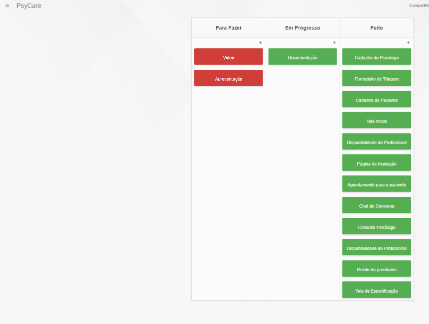
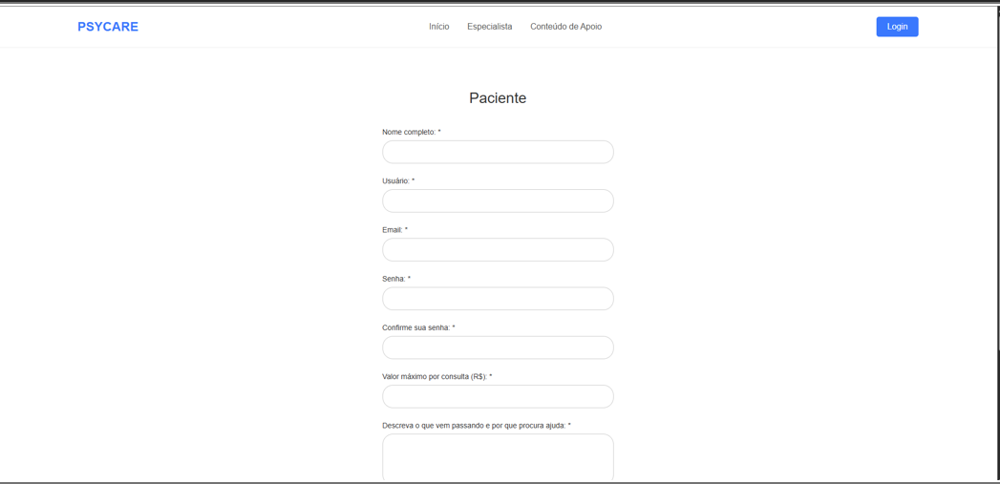
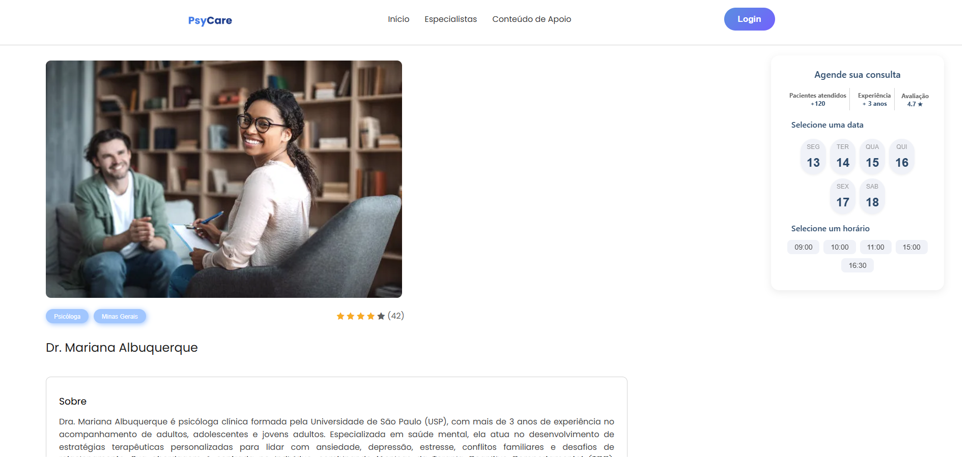
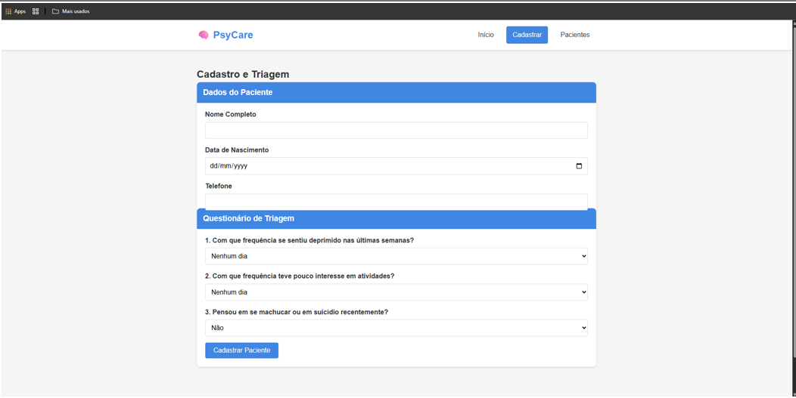
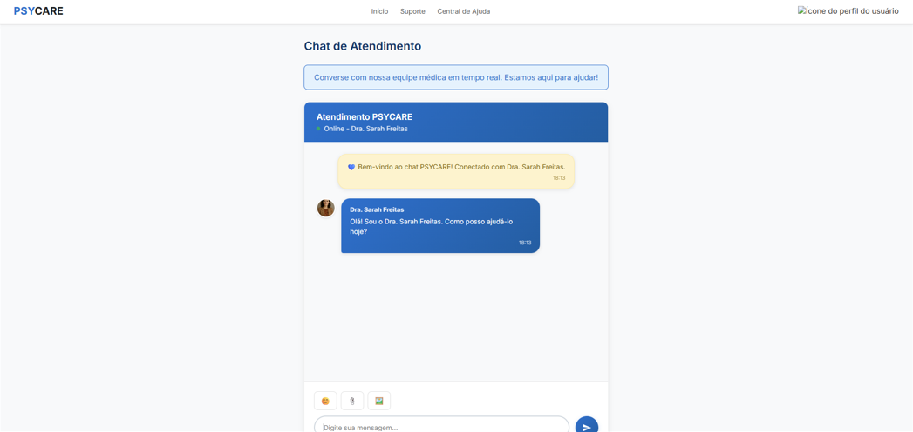
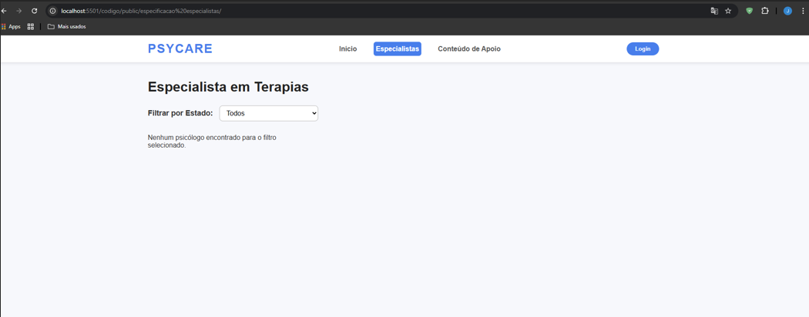
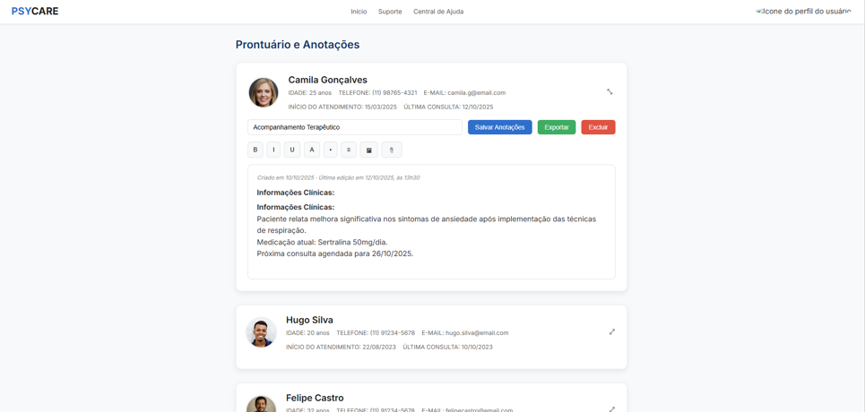

# Introdução

**Projeto**: PsyCare

**Repositório GitHub**: https://github.com/ICEI-PUC-Minas-PMGES-TI/pmg-es-2025-2-ti1-2401100-psycare

**Membros integrantes da Equipe:**
 * Gabriel Eduardo de Oliveira
 * Júlia Carvalho Silva
 * Júlia do Carmo Costa Rocha e Silva
 * Lucas Cardoso
 * Nathaly Nagem Araujo
 * Yago Garzon Chaves

## Contexto

A saúde mental é um direito humano fundamental, tão importante quanto o cuidado com o corpo, mas para milhões de brasileiros em situação de vulnerabilidade, ela permanece como um privilégio distante. Enquanto o esgotamento mental silenciosamente corroí vidas, a luta diária por sustento, moradia e dignidade empurra o autocuidado para as sombras, como se fosse um luxo a ser adiado. Esse abandono aprofunda o sofrimento individual e também perpetua o ciclo da pobreza, onde uma mente sobrecarregada encontra barreiras ainda maiores para buscar oportunidades e melhorar de vida. É nesse abismo entre a necessidade urgente e o acesso inexistente que surge a ideia de uma solução: criar um porto seguro digital acessível, onde o primeiro passo para o cuidado não tenha barreira.

## Problema

A dificuldade de acesso à saúde mental para a população de baixa renda cria uma crise invisível, que se agrava em silêncio. O sistema público, embora essencial, frequentemente opera sobrecarregado, com filas de espera que se estendem por meses, transformando um pedido de ajuda em um longo e desgastante processo. Paralelamente, o estigma que ainda cerca os transtornos psicológicos faz com que muitos encarem sua própria dor como fraqueza, optando pelo silêncio em vez de buscar apoio. Para quem já vive sob o peso da instabilidade financeira, a simples ideia de custear uma terapia particular parece um sonho distante, deixando-os presos em um poço de angústia sem uma saída visível. O resultado é uma multidão de pessoas enfrentando suas batalhas completamente sozinhas, sem informação, sem direção e sem a esperança de que um amparo sequer existe.

## Objetivo

Diante desse cenário, o objetivo central deste projeto é construir uma ponte digital que una quem precisa de ajuda a um meio de acolhimento. Mais do que um site, a ideia é criar um porto seguro acessível a todos a qualquer hora. A plataforma busca ser uma primeira resposta concreta, oferecendo profissionais capacitados que forneça desde técnicas simples para acalmar uma crise iminente até informações claras que ajudem qualquer pessoa a entender o que está sentindo, quebrando o ciclo de desinformação e medo. Trata-se, acima de tudo, de garantir que o primeiro passo para o cuidado seja dado, direcionando cada pessoa para a rede de apoio adequada e, assim, plantando a ideia de que recuperar o bem-estar mental não é um privilégio, mas um direito que deve ser alcançado por todos.

## Justificativa

A escolha do tema saúde mental se da ao fato de que todos os integrantes do grupo reconhecem os impactos que a falta de acesso a cuidados psicológicos causa na vida de pessoas próximas, seja por relatos pessoais, de familiares ou amigos. O cenário atual no Brasil escancara uma desigualdade gritante já que enquanto parte da população dispõe de recursos para custear terapias e atendimentos, milhões ficam à margem, sem alternativas viáveis para buscar ajuda. A ausência de canais acessíveis e o estigma social ainda associado aos transtornos emocionais aprofundam esse abismo. Nesse sentido, o PsyCare nasce como resposta prática a uma necessidade urgente: oferecer um espaço digital inclusivo, acessível e confiável, que conecte indivíduos vulneráveis a recursos de acolhimento e orientação. A proposta vai além da tecnologia; trata-se de um compromisso com a dignidade humana, com a ideia de que saúde mental é um direito, não um privilégio.

## Público-Alvo

O PsyCare tem como público principal pessoas em situação de vulnerabilidade social que enfrentam dificuldades de acesso a serviços de saúde mental, mas não apenas elas. A plataforma também se destina a estudantes, trabalhadores sobrecarregados, cuidadores e qualquer indivíduo que, por questões financeiras, sociais ou emocionais, encontra barreiras para buscar apoio psicológico. Além disso, profissionais da área da saúde e instituições parceiras podem se beneficiar da ferramenta como um canal de comunicação, informação e orientação, ampliando seu alcance e impacto. Dessa forma, o PsyCare busca atender tanto quem procura ajuda imediata quanto quem deseja compreender melhor sua própria saúde mental, criando um sistema de apoio mais acessível, empático e humano.

## Product Discovery

## Etapa de Entendimento

**Matriz CSD**

**Mapa de StakeHolders**

**Entrevistas qualitativas:**

**Highlights de pesquisa**

## Etapa de Definição
### Personas

| Persona 1 | Persona 2 |
| --------- | --------- |
| |  |

| Persona 3 | Persona 4 |
| --------- | --------- |
| |  |

| Persona 5 | Persona 6 |
| --------- | --------- |
|  | |

## Product Desing

| EU COMO...`PERSONA` | QUERO/PRECISO ...`FUNCIONALIDADE`        | PARA ...`MOTIVO/VALOR`               |
| --------------------- | ------------------------------------------ | -------------------------------------- |
| Usuário: Psicólogo  | Ter uma sala de videoconferência segura | Realizar sessões online privadas e práticas para mim e para meus pacientes |
| Usuário: Psicólogo  |  Definir meus horários disponíveis | Evitar agendamentos em conflito com minha agenda |
| Usuário: Psicólogo  | Registrar anotações privadas sobre as sessões | Manter um histórico organizado e acessível de cada paciente |
| Usuário: Paciente  | Filtrar psicólogos por valor da consulta | Encontrar profissionais que cabem no meu orçamento |
| Usuário: Paciente  | Ter um histórico das minhas sessões e evolução | Acompanhar meu progresso ao longo do tempo |
| Usuário: Paciente  | Ter acesso a materiais de apoio | Dar continuidade ao meu processo terapêutico entre as sessões |

## Proposta de Valor

| 1: Sarah | 2: Carlos |
| ----- | ------ |
|  |  |

| 3: Lucas | 4: Camila |
| ----- | ------ |
|  | |

| 5: Hugo | 6: Felipe |
| ----- | ------ |
| |  |

## Requisitos

| ID     | Descrição do Requisito                                                                                                                             | Prioridade |
| ------ | -------------------------------------------------------------------------------------------------------------------------------------------------- | ---------- |
| RF-001 | Exibir uma página inicial com informações e orientações sobre saúde mental                                                                         | ALTA       |
| RF-002 | Permitir que o usuário agende consultas ou sessões com profissionais voluntários                                                                   | ALTA       |
| RF-003 | Mostrar os horários disponíveis de cada profissional                                                                                               | MÉDIA      |
| RF-004 | Possibilitar que o usuário visualize, remarque ou cancele suas consultas                                                                           | ALTA       |
| RF-005 | Disponibilizar conteúdos educativos em texto, vídeo e áudio sobre saúde mental                                                                     | MÉDIA      |
| RF-006 | Permitir que o usuário salve conteúdos para acessar depois                                                                                         | MÉDIA      |
| RF-007 | Oferecer uma área de perfil para que o usuário veja e edite seus dados básicos                                                                     | MÉDIA      |
| RF-008 | Possibilitar o envio de mensagens privadas ao profissional antes ou depois das sessões                                                             | BAIXA      |
| RF-009 | Contar com chat em tempo real durante a consulta, se houver autorização do profissional                                                            | MÉDIA      |
| RF-010 | Permitir que o usuário busque profissionais por especialidade ou tipo de atendimento                                                               | ALTA       |
| RF-011 | Enviar notificações ou lembretes de consultas por e-mail ou pelo próprio site                                                                      | MÉDIA      |
| RF-012 | Oferecer a opção de avaliar a consulta e enviar feedback anônimo sobre o atendimento                                                               | BAIXA      |
| RF-013 | Exibir um canal de ajuda emergencial com contatos de apoio 24 horas (CVV) e disponibilizar chat imediato para casos de crise                       | ALTA       |
| RF-014 | Disponibilizar um chat interno permanente dentro da plataforma, que envie notificações e permita tirar dúvidas gerais sobre o serviço ou conteúdos | MÉDIA      |
| RF-015 | Disponibilizar para o administrador a função de cadastrar, atualizar ou remover profissionais e seus horários                                      | ALTA       |
| RF-016 | Permitir que a pessoa agende um atendimento sem precisar de cadastro completo, informando apenas nome e meio de contato                            | MÉDIA      |
| RF-017 | Disponibilizar um formulário de triagem inicial para entender a necessidade do usuário e direcioná-lo ao profissional adequado                     | ALTA       |

| ID      | Descrição do Requisito                                                                                  | Prioridade |
| ------- | ------------------------------------------------------------------------------------------------------- | ---------- |
| RNF-001 | Funcionamento 24 horas por dia, 7 dias por semana                                                       | ALTA       |
| RNF-002 | Compatibilidade com computadores, tablets e smartphones                                                 | ALTA       |
| RNF-003 | Carregamento de cada página em até 3 segundos em conexão padrão                                         | MÉDIA      |
| RNF-004 | Hospedagem em servidor público seguro com certificado SSL (HTTPS)                                       | ALTA       |
| RNF-005 | Desenvolvimento usando exclusivamente HTML, CSS e JavaScript                                            | MÉDIA      |
| RNF-006 | Interface intuitiva e simples, adequada a pessoas com pouca familiaridade com tecnologia                | ALTA       |
| RNF-007 | Conformidade com diretrizes de acessibilidade (contraste, descrição de imagens e navegação por teclado) | ALTA       |
| RNF-008 | Proteção de dados criptografados e tratamento conforme a LGPD                                           | ALTA       |
| RNF-009 | Capacidade de suportar aumento de usuários e profissionais sem perda de desempenho                      | ALTA       |
| RNF-010 | Backup automático diário com possibilidade de recuperação rápida em caso de falhas ou ataques           | ALTA       |

## Projeto de Interface

**Protótipo de tela**

* **Home Page**

* **Login de pacientes**

* **Login de colaboradores**

* **Tela de detalhes dos colaboradores**

* **Conteúdo de apoio**

* **Tela de Psicólogos**

* **Tela de Agendamento de Consultas**

* **Tela ao clicar em Agendar**

* **Painel Colaborador (Atendentes)**

## User Flow: Protótipo Interativo
* [Protótipo Interativo (Figma)](https://www.figma.com/proto/j5nm5aKOJQCnX30cXPmdSb/Sa%C3%BAde-Mental?node-id=3-44&t=wtntbEqNcDvFQ825-1&scaling=min-zoom&content-scaling=fixed&page-id=0%3A1&starting-point-node-id=3%3A44)

## Metodologia 

## Ferramentas

| Ambiente                    | Plataforma | Link de acesso                                     |
| --------------------------- | ---------- | -------------------------------------------------- |
| Processo de Design Thinking | Miro       | https://miro.com/app/board/uXjVJSvOcvk=/ |
| Repositório de código     | GitHub     | https://github.com/ICEI-PUC-Minas-PMGES-TI/pmg-es-2025-2-ti1-2401100-psycare |
| Protótipo do site         | Figma      | https://www.figma.com/proto/j5nm5aKOJQCnX30cXPmdSb/Sa%C3%BAde-Mental?node-id=20-532&t=wtntbEqNcDvFQ825-1&scaling=scale-down-width&content-scaling=fixed&page-id=0%3A1&starting-point-node-id=3%3A44 |
| Protótipo Interativo       | Figma  | https://www.figma.com/proto/j5nm5aKOJQCnX30cXPmdSb/Sa%C3%BAde-Mental?node-id=20-532&t=wtntbEqNcDvFQ825-1&scaling=scale-down-width&content-scaling=fixed&page-id=0%3A1&starting-point-node-id=3%3A44   |

## Gerenciamento do Projeto

O grupo se organizou seguindo princípios do framework Scrum, adaptados à realidade acadêmica do projeto. Foram realizadas reuniões rápidas para alinhamento das atividades e definição das prioridades.
Os papéis foram definidos da seguinte forma:
Product Owner: responsável por definir os requisitos da aplicação, funcionalidades principais e regras de negócio. No caso da Psycare seria Yago Garzon Chaves
Scrum Master: responsável por auxiliar na organização do trabalho, remoção de impedimentos e acompanhamento do andamento das tarefas. No caso da Psycare, seria Júlia do Carmo.
Time de Desenvolvimento: responsável pela implementação do código, criação das telas, lógica de funcionamento e integração com o JSON Server.
As tarefas foram divididas em pequenas entregas, permitindo que cada integrante contribuísse de forma contínua ao longo do desenvolvimento.

# Solução Implementada
Funcionalidade 1 - Cadastro do Paciente
Permite que pacientes realizem seu cadastro na plataforma PsyCare, criando uma conta para acesso às funcionalidades do sistema, como agendamentos, triagem e consultas.
Estrutura de dados: Pacientes
Instruções de acesso:
Acesse o site e acesse a tela de cadastro
Preencha seus dados
Confirme os dados para a criação da conta
Tela da Funcionalidade:

Funcionalidade 2 - Cadastro do Psicólogo
Permite o cadastro de psicólogos na plataforma, possibilitando que profissionais ofereçam atendimento psicológico aos pacientes.
Estrutura de dados: Psicólogos
Instruções de acesso:
Acesse o site e acesse a tela de cadastro
Preencha seus dados
Confirme os dados para a criação da conta
Tela da Funcionalidade: 

Funcionalidade 3 - Agendamento para o paciente
Permite que pacientes realizem o agendamento de consultas com psicólogos disponíveis na plataforma.
Estrutura de dados: Agendamento
Instruções de acesso:
Acesse o site
Acesse a tela de agendamento
Escolha o profissional, data e horário disponíveis, digite suas informações e confirma a solicitação.

Funcionalidade 4 - Formulário de triagem
Permite a coleta inicial de informações sobre o paciente, auxiliando na avaliação preliminar de suas necessidades psicológicas.
Estrutura de dados: Triagem
Instruções de acesso:
Acesse a tela de triagem
Preencha as informações
Confirme as informações e envie.

Funcionalidade 5 - Consulta do psicólogo
Permite que o psicólogo visualize suas consultas agendadas e os dados básicos do paciente.
Estrutura de dados: Consulta Psicólogo
Instruções de acesso:
Acesse o site
Faça login como psicólogo
Vá para área de consultas

Funcionalidade 6 - Chat de conversa
Disponibiliza um canal de comunicação entre paciente e psicólogo, garantindo troca de mensagens de forma segura.
Estrutura de dados: Chat
Instruções de acesso:
Acesse a tela de login
Abra a janela do chat

Funcionalidade 7 - Tela de especificação
Apresenta informações detalhadas sobre o serviço, profissional ou consulta, permitindo melhor compreensão por parte do usuário.

Estrutura de dados: Especificação Especialistas
Instruções de acesso:
Acesse o site
Clique em Especialistas

Funcionalidade 8 - Relato do prontuário
Permite que o psicólogo registre anotações sobre o atendimento realizado, compondo o prontuário do paciente.
Estrutura de dados: Prontuário
Instruções de acesso:
Acesse o site
Faça login como psicológo
Acessa a tela de prontuários

Funcionalidade 9 - Página de avaliação
Permite que pacientes avaliem o atendimento recebido, contribuindo para a melhoria contínua da plataforma.
Estrutura de dados: Avaliação
Instruções de acesso:
Após a consulta, acesse a página de avaliação
Preencha as informações e envie.

Funcionalidade 10 - Disponibilidade do Profissional
Permite que o psicólogo defina seus dias e horários disponíveis para atendimento.
Estrutura de dados: Disponibilidade do Psicólogo
Instruções de acesso:
Acesse o site
Faça login como psicólogo
Acesse a tela de disponibilidade

Funcionalidade 11 - Disponibilidade de conteúdos
Disponibiliza conteúdos informativos relacionados à saúde mental, como artigos e orientações.
Estrutura de dados: Disponibilidade de conteúdo
Instruções de acesso:
Acesse o site
Clique em conteúdo de apoio

## Vídeo do Projeto

O vídeo a seguir traz uma apresentação do problema que a equipe está tratando e a proposta de solução. ⚠️ EXEMPLO ⚠️

## Funcionalidades

Esta seção apresenta as funcionalidades da solução.Info

##### Funcionalidade 1 
Funcionalidade 1 - Cadastro do Paciente
Permite que pacientes realizem seu cadastro na plataforma PsyCare, criando uma conta para acesso às funcionalidades do sistema, como agendamentos, triagem e consultas.
•	Estrutura de dados: Pacientes
•	Instruções de acesso:
o	Acesse o site e acesse a tela de cadastro
o	Preencha seus dados
o	Confirme os dados para a criação da conta
•	Tela da Funcionalidade:

##### Funcionalidade 2
Permite o cadastro de psicólogos na plataforma, possibilitando que profissionais ofereçam atendimento psicológico aos pacientes.
•	Estrutura de dados: Psicólogos
•	Instruções de acesso:
o	Acesse o site e acesse a tela de cadastro
o	Preencha seus dados
o	Confirme os dados para a criação da conta
•	Tela da Funcionalidade: 

##### Funcionalidade 3
Permite que pacientes realizem o agendamento de consultas com psicólogos disponíveis na plataforma.
•	Estrutura de dados: Agendamento
•	Instruções de acesso:
o	Acesse o site
o	Acesse a tela de agendamento
o	Escolha o profissional, data e horário disponíveis, digite suas informações e confirma a solicitação.
•	Tela da Funcionalidade: 

##### Funcionalidade 4
Permite a coleta inicial de informações sobre o paciente, auxiliando na avaliação preliminar de suas necessidades psicológicas.
•	Estrutura de dados: Triagem
•	Instruções de acesso:
o	Acesse a tela de triagem
o	Preencha as informações
o	Confirme as informações e envie.
•	Tela da Funcionalidade: 

##### Funcionalidade 5
Permite o cadastro de psicólogos na plataforma, possibilitando que profissionais ofereçam atendimento psicológico aos pacientes.
•	Estrutura de dados: Psicólogos
•	Instruções de acesso:
o	Acesse o site e acesse a tela de cadastro
o	Preencha seus dados
o	Confirme os dados para a criação da conta

##### Funcionalidade 6
Disponibiliza um canal de comunicação entre paciente e psicólogo, garantindo troca de mensagens de forma segura.
•	Estrutura de dados: Chat
•	Instruções de acesso:
o	Acesse a tela de login
o	Abra a janela do chat
•	Tela da Funcionalidade:

##### Funcionalidade 7
Apresenta informações detalhadas sobre o serviço, profissional ou consulta, permitindo melhor compreensão por parte do usuário.

•	Estrutura de dados: Especificação Especialistas
•	Instruções de acesso:
o	Acesse o site
o	Clique em Especialistas
•	Tela da Funcionalidade:

##### Funcionalidade 8
Permite que o psicólogo registre anotações sobre o atendimento realizado, compondo o prontuário do paciente.
•	Estrutura de dados: Prontuário
•	Instruções de acesso:
o	Acesse o site
o	Faça login como psicológo
o	Acessa a tela de prontuários
•	Tela da Funcionalidade: 

##### Funcionalidade 9
Permite que pacientes avaliem o atendimento recebido, contribuindo para a melhoria contínua da plataforma.
•	Estrutura de dados: Avaliação
•	Instruções de acesso:
o	Após a consulta, acesse a página de avaliação
o	Preencha as informações e envie.

##### Funcionalidade 10
Permite que o psicólogo defina seus dias e horários disponíveis para atendimento.
•	Estrutura de dados: Disponibilidade do Psicólogo
•	Instruções de acesso:
o	Acesse o site
o	Faça login como psicólogo
o	Acesse a tela de disponibilidade
o	Preencha as informações e envie.
•	Tela da Funcionalidade:

##### Funcionalidade 11
Disponibiliza conteúdos informativos relacionados à saúde mental, como artigos e orientações.
•	Estrutura de dados: Disponibilidade de conteúdo
•	Instruções de acesso:
o	Acesse o site
o	Clique em conteúdo de apoio

## Estruturas de Dados

Descrição das estruturas de dados utilizadas na solução com exemplos no formato JSON.Info
Estrutura de Dados - Pacientes
Pacientes da aplicação
{
  "pacientes": [
    {
      "id": 1,
      "nome": "João Silva",
      "usuario": "joao123",
      "email": "joao@example.com",
      "senha": "hashed_password_simulado",
      "valorMaximo": 10.00,
      "descricao": "Estou passando por ansiedade e procuro ajuda para gerenciar o estresse."
    },
    {
      "id": 2,
      "nome": "Maria Oliveira",
      "usuario": "maria456",
      "email": "maria@example.com",
      "senha": "hashed_password_simulado",
      "valorMaximo": 20.00,
      "descricao": "Problemas de depressão e dificuldade em socializar."
    }
  ]
}

## Estruturas de Dados – Psicólogos
Psicólogos na aplicação
{
  "psicologos": [
    {
      "id": 1,
      "nome": "Dra. Mariana Castro",
      "crp": "06/12345",
      "email": "mariana.castro@psycare.com",
      "telefone": "(31) 98765-4321",
      "dataNascimento": "1985-03-15",
      "genero": "Feminino",
      "estado": "MG",
      "formacao": "Psicologia - USP",
      "tempoExperiencia": 8,
      "modalidadeAtendimento": "Hibrido",
      "descricaoProfissional": "Psicóloga clínica especializada em TCC para ansiedade e depressão, com foco em adultos jovens.",
      "especialidade": "Terapia Cognitivo-Comportamental (TCC)",
      "disponibilidade": {
        "dias": ["Segunda", "Quarta", "Sexta"],
        "horarios": ["09:00-12:00", "14:00-18:00"]
      },
      "datasEspecificas": ["2025-01-13", "2025-01-20"],
      "usuario": "mariana123",
      "senha": "hash_simulado_mariana",
      "dataCadastro": "2025-01-01T10:00:00.000Z",
      "status": "ativo"
    },
    {
      "id": 2,
      "nome": "Dr. Ricardo Nunes",
      "crp": "06/67890",
      "email": "ricardo.nunes@psycare.com",
      "telefone": "(31) 91234-5678",
      "dataNascimento": "1978-07-22",
      "genero": "Masculino",
      "estado": "SP",
      "formacao": "Psiquiatria - UFMG",
      "tempoExperiencia": 12,
      "modalidadeAtendimento": "Presencial",
      "descricaoProfissional": "Psiquiatra com foco em transtornos do humor e saúde mental geral.",
      "especialidade": "Psiquiatria e Transtornos do Humor",
      "disponibilidade": {
        "dias": ["Terça", "Quinta"],
        "horarios": ["08:00-11:00", "15:00-17:00"]
      },
      "datasEspecificas": ["2025-01-15"],
      "usuario": "ricardo456",
      "senha": "hash_simulado_ricardo",
      "dataCadastro": "2025-01-02T14:30:00.000Z",
      "status": "ativo"
    }
]
}

## Estruturas de DadosAgendamento
Agendamentos na aplicação
{
  "consultas": [
    {
      "nome": "Rosilene do Carmo Silva",
      "celular": "(31) 974584545",
      "email": "rodocarm@gmail.com",
      "mensagem": "Quero falar sobre minha familia",
      "dia": "13",
      "horario": "10:00",
      "psicologo": "Dr. Mariana Albuquerque",
      "assunto": "Consulta comigo",
      "id": 1
    },
    {
      "nome": "Julia Teste",
      "celular": "(31) 99744-74898",
      "email": "juliatest@test.com",
      "mensagem": "Quero falar sobre mim",
      "dia": "13",
      "horario": "09:00",
      "psicologo": "Dr. Mariana Albuquerque",
      "assunto": "Consulta psicológica",
      "id": 2
    },
    {
      "nome": "Nayara",
      "celular": "(31) 99744-74898",
      "email": "juliatest@test.com",
      "mensagem": "Quero falar sobre a minha sexualidade.",
      "dia": "18",
      "horario": "16:30",
      "psicologo": "Dr. Mariana Albuquerque",
      "assunto": "Consulta psicológica",
      "id": 3
    },
    {
      "nome": "Danielle Rocha",
      "celular": "(31) 78896-84521",
      "email": "danieller@gmail.com",
      "mensagem": "Quero falar sobre mim.",
      "dia": "13",
      "horario": "16:30",
      "psicologo": "Dr. Mariana Albuquerque",
      "assunto": "Consulta psicológica",
      "id": 5
    },
    {
      "nome": "Ariadne",
      "celular": "31545565",
      "email": "ariadne@gmail.com",
      "mensagem": "Quero falar sobre a minha familia.",
      "dia": "13",
      "horario": "10:00",
      "psicologo": "Dr. Mariana Albuquerque",
      "assunto": "Quero falar sobre a minha familia.",
      "id": 7
    }
  ]
}

## Estruturas de Dados– Chat
Chat de conversa na aplicação
{
  "respostasAutomaticas": [
    {
      "id": "saudacao",
      "triggers": ["oi", "olá", "ola", "bom dia", "boa tarde", "boa noite"],
      "respostas": [
        "Olá! É um prazer conversar com você. Como você está se sentindo hoje?",
        "Oi! Fico feliz em falar com você. Em que posso ajudar?",
        "Olá! Sou a Dra. Sarah Freitas. Como posso ajudá-lo hoje?"
      ]
    },
    {
      "id": "ansiedade",
      "triggers": ["ansiedade", "ansioso", "ansiosa", "nervoso", "nervosa", "preocupado", "preocupada"],
      "respostas": [
        "Entendo que a ansiedade pode ser desafiadora. Podemos trabalhar juntos em técnicas para gerenciar esses sentimentos.",
        "A ansiedade é uma resposta natural do corpo. Vamos conversar sobre o que tem desencadeado isso em você.",
        "Muitas pessoas experienciam ansiedade. É importante identificar os gatilhos e desenvolver estratégias de coping."
      ]
    },
    {
      "id": "depressao",
      "triggers": ["depressão", "depressao", "deprimido", "deprimida", "triste", "tristeza", "desanimado"],
      "respostas": [
        "A depressão é uma condição séria, mas tratável. É muito corajoso da sua parte buscar ajuda.",
        "Entendo que você pode estar passando por um momento difícil. Vamos conversar sobre o que você tem experienciado.",
        "A depressão afeta muitas pessoas e é importante buscar apoio. Estou aqui para ajudar."
      ]
    },
    {
      "id": "consulta",
      "triggers": ["consulta", "horário", "horario", "agendar", "marcar", "disponibilidade"],
      "respostas": [
        "Posso ajudá-lo a agendar uma consulta. Temos disponibilidade nos próximos dias. Você prefere horário pela manhã ou à tarde?",
        "Para marcar uma consulta, você pode ligar para (32) 3319-4444 ou acessar nosso site.",
        "Tenho disponibilidade na próxima semana. Gostaria de ver os horários?"
      ]
    },
    {
      "id": "medicacao",
      "triggers": ["remédio", "remedio", "medicamento", "medicação", "medicacao", "tarja preta", "ansiolítico"],
      "respostas": [
        "Sobre medicações, é importante conversarmos detalhadamente. Posso esclarecer dúvidas, mas ajustes devem ser discutidos em consulta.",
        "Medicações psiquiátricas exigem acompanhamento profissional. Vamos agendar uma consulta para discutir isso adequadamente.",
        "Cada caso requer uma avaliação individual para a prescrição medicamentosa. Posso te orientar sobre isso em consulta."
      ]
    },
    {
      "id": "agradecimento",
      "triggers": ["obrigado", "obrigada", "grato", "grata", "valeu", "agradeço"],
      "respostas": [
        "De nada! Estou aqui para ajudar. Se tiver mais alguma dúvida ou preocupação, fique à vontade para compartilhar.",
        "Fico feliz em poder ajudar! Não hesite em me procurar se precisar de mais orientações.",
        "Por nada! Cuidar da sua saúde mental é muito importante. Estou à disposição."
      ]
    },
    {
      "id": "padrao",
      "triggers": ["*"],
      "respostas": [
        "Entendo. Pode me contar um pouco mais sobre isso?",
        "Obrigada por compartilhar. Como isso tem afetado seu dia a dia?",
        "Compreendo sua preocupação. Vamos trabalhar juntos nisso.",
        "Pode explicar um pouco melhor o que você está sentindo?",
        "Estou aqui para ouvir e ajudar. Continue compartilhando.",
        "Isso soa importante. Gostaria de explorar mais esse assunto?"
      ]
    }
  ]
}

## Estruturas de Dados– Especificação Especialistas
Visualização das especificações dos especialistas na aplicação
{
  "psicologos": [
    {
      "id": 1,
      "nome": "Dra. Mariana Castro",
      "crp": "06/12345",
      "email": "mariana.castro@psycare.com",
      "telefone": "(31) 98765-4321",
      "dataNascimento": "1985-03-15",
      "genero": "Feminino",
      "estado": "MG",
      "formacao": "Psicologia - USP",
      "tempoExperiencia": 8,
      "modalidadeAtendimento": "Hibrido",
      "descricaoProfissional": "Psicóloga clínica especializada em TCC para ansiedade e depressão, com foco em adultos jovens.",
      "especialidade": "Terapia Cognitivo-Comportamental (TCC)",
      "disponibilidade": {
        "dias": ["Segunda", "Quarta", "Sexta"],
        "horarios": ["09:00-12:00", "14:00-18:00"]
      },
      "datasEspecificas": ["2025-01-13", "2025-01-20"],
      "usuario": "mariana123",
      "senha": "hash_simulado_mariana",
      "dataCadastro": "2025-01-01T10:00:00.000Z",
      "status": "ativo"
    },
    {
      "id": 2,
      "nome": "Dr. Ricardo Nunes",
      "crp": "06/67890",
      "email": "ricardo.nunes@psycare.com",
      "telefone": "(31) 91234-5678",
      "dataNascimento": "1978-07-22",
      "genero": "Masculino",
      "estado": "SP",
      "formacao": "Psiquiatria - UFMG",
      "tempoExperiencia": 12,
      "modalidadeAtendimento": "Presencial",
      "descricaoProfissional": "Psiquiatra com foco em transtornos do humor e saúde mental geral.",
      "especialidade": "Psiquiatria e Transtornos do Humor",
      "disponibilidade": {
        "dias": ["Terça", "Quinta"],
        "horarios": ["08:00-11:00", "15:00-17:00"]
      },
      "datasEspecificas": ["2025-01-15"],
      "usuario": "ricardo456",
      "senha": "hash_simulado_ricardo",
      "dataCadastro": "2025-01-02T14:30:00.000Z",
      "status": "ativo"
    },
    {
      "id": 3,
      "nome": "Dra. Juliana Prado",
      "crp": "06/54321",
      "email": "juliana.prado@psycare.com",
      "telefone": "(31) 99876-5432",
      "dataNascimento": "1990-11-08",
      "genero": "Feminino",
      "estado": "RJ",
      "formacao": "Psicologia Infantil - PUC Minas",
      "tempoExperiencia": 5,
      "modalidadeAtendimento": "Remoto",
      "descricaoProfissional": "Psicóloga infantil especializada em lidar com emoções e dificuldades escolares em crianças.",
      "especialidade": "Psicologia Infantil e Emoções",
      "disponibilidade": {
        "dias": ["Segunda", "Quarta", "Sexta"],
        "horarios": ["10:00-13:00"]
      },
      "datasEspecificas": [],
      "usuario": "juliana789",
      "senha": "hash_simulado_juliana",
      "dataCadastro": "2025-01-03T09:15:00.000Z",
      "status": "pendente"
    }
  ]
}

## Estruturas de Dados - Disponibilidade do Psicólogo
Visualização da disponibilidade do psicólogo na aplicação
{
  "descricao": "Esquema da estrutura de dados para o objeto 'psicologo'. Este é um arquivo de modelo, os dados reais são salvos no localStorage pelo JavaScript.",
  "estrutura": {
    "psicologo": {
      "id": "number",
      "nome": "string",
      "crp": "string",
      "email": "string",
      "telefone": "string",
      "dataNascimento": "string (YYYY-MM-DD)",
      "genero": "string",
      "formacao": "string",
      "tempoExperiencia": "number (anos)",
      "modalidadeAtendimento": "string (online/presencial/ambos)",
      
      "descricaoProfissional": "string",
      "especialidade": "string",
      
      "disponibilidade": {
        "dias": [
          "string (ex: Segunda, Terca)"
        ],
        "horarios": [
          "string (ex: 09:00-12:00)"
        ]
      },
      
      "datasEspecificas": [
        "string (ex: 2025-01-13) - Opcional, do calendário visual"
      ],
      
      "usuario": "string",
      "senha": "string (hash simulado)",
      "dataCadastro": "string (ISO 8601)",
      "status": "string (pendente/ativo)"
    }
  }
}

>
> **Orientações:**
>
> * [JSON Introduction](https://www.w3schools.com/js/js_json_intro.asp)
> * [Trabalhando com JSON - Aprendendo desenvolvimento web | MDN](https://developer.mozilla.org/pt-BR/docs/Learn/JavaScript/Objects/JSON)

## Módulos e APIs

Módulos e APIs
Frameworks, bibliotecas e módulos:
•	HTML5: estrutura das páginas.
•	CSS3: estilização e layout das telas. 
•	JavaScript: lógica da aplicação, validações, manipulação do DOM e requisições HTTP.
•	JSON Server: simulação de uma API REST para persistência de dados.

**Fonts:**
[https://fontawesome.com/](https://fonts.googleapis.com/css2?family=Inter:wght@400;600;700&display=swap) 
[https://fontawesome.com/](https://cdnjs.cloudflare.com/ajax/libs/font-awesome/4.7.0/css/font-awesome.min.css ) 

# Referências

STACK OVERFLOW. Stack Overflow. Disponível em: https://stackoverflow.com/. 
JSON SERVER. JSON Server. Disponível em: https://www.npmjs.com/package/json-server. 
GITHUB. GitHub. Disponível em: https://github.com/. 

>
> - [Formato ABNT](https://www.normastecnicas.com/abnt/trabalhos-academicos/referencias/)
> - [Referências Bibliográficas da ABNT](https://comunidade.rockcontent.com/referencia-bibliografica-abnt/)
